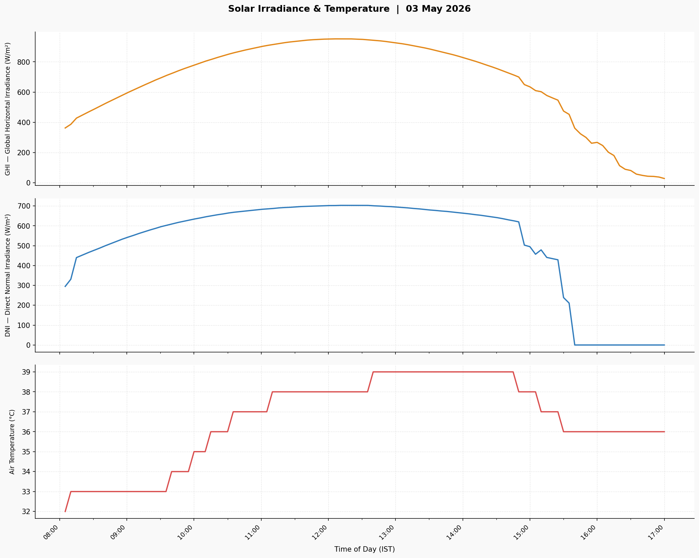
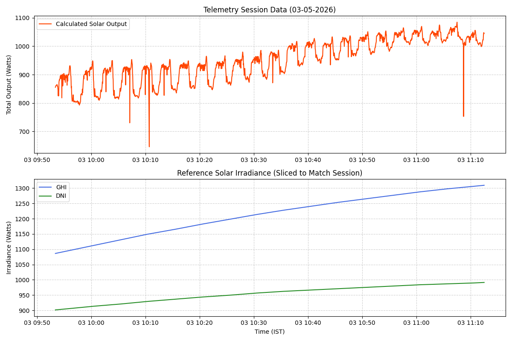
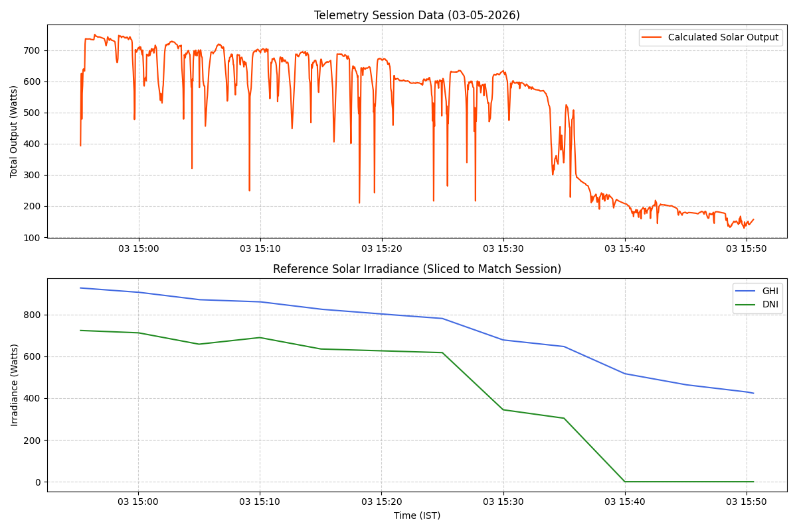
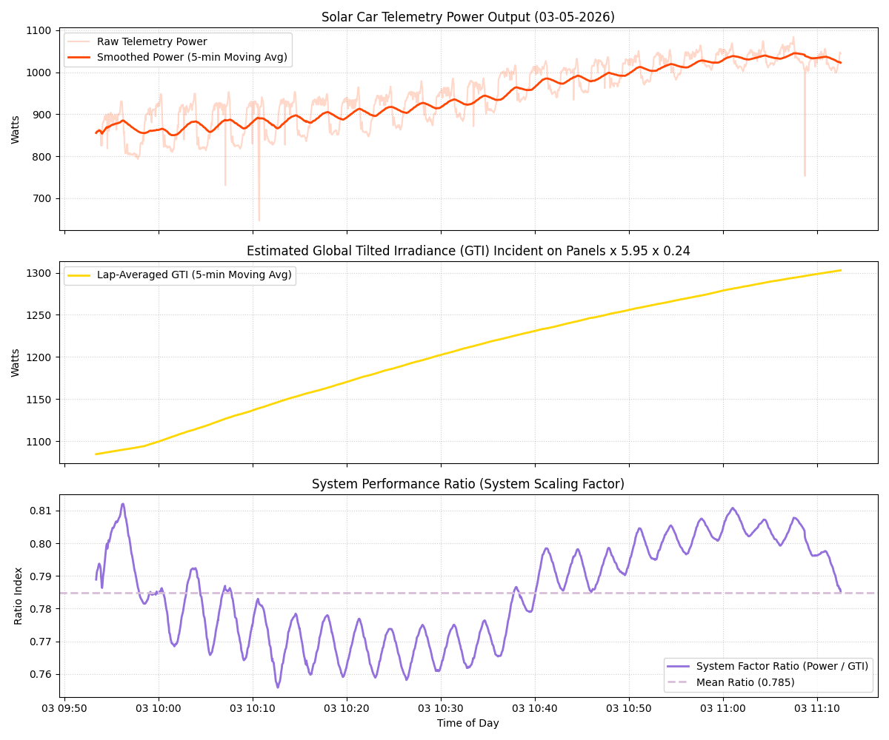
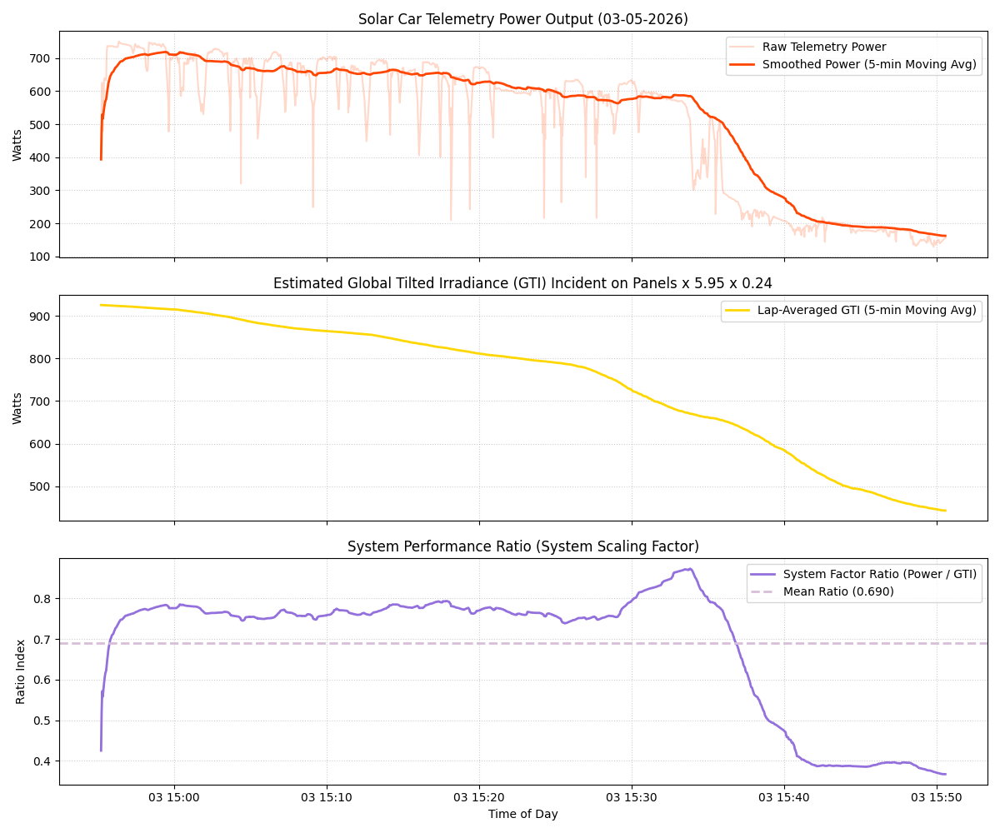

# Solar Telemetry and Irradiance Analysis Pipeline

This folder contains a data processing and analysis pipeline designed to scrape solar irradiance data, interpolate it to match real-time vehicle telemetry frequencies, simulate Global Tilt Irradiance (GTI) over a representative driving lap, and evaluate the real-world operational efficiency of the onboard solar panel arrays.

## Pipeline Overview & Workflow

The analysis is performed sequentially through the following scripts:

```
[solcast_scraping.py] ──> (JSONL Irradiance Data)
                               │
                               ├──> [solcastPlotter.py] ──> (Visualization PNGs)
                               │
                               └──> [solar_interpolation.py] (5-min to 2-sec)
                                             │
                                             v
[Telemetry Files] ───────────────────> [solar_output_comparison.py]
                                             │
                                             v
                                     [solar_ratio.py]
                                             │
                                             v
                               [find_all_efficiency.py] ──> Final Operational Efficiency (18%)
```

---

## Script Descriptions

### 1. `solcast_scraping.py`
* **Purpose:** Fetches historical or forecast solar irradiance data for a specified date.
* **Inputs:** Target date parameter.
* **Outputs:** A `.jsonl` (JSON Lines) file containing 5 minute solar metrics from **8:00 AM to 5:00 PM**.
* **Key Fields Extracted:** Global Horizontal Irradiance (GHI), Direct Normal Irradiance (DNI), and Air Temperature.

### 2. `solcastPlotter.py`
* **Purpose:** Validates and visualizes the scraped meteorological datasets.
* **Inputs:** `.jsonl` file from `solcast_scraping.py`.
* **Outputs:** `.png` plots illustrating the curves for GHI, DNI, and Air Temperature over the daytime window to visually screen for anomalies or cloud cover.
* **Sample Output:** 

### 3. `solar_interpolation.py`
* **Purpose:** Upsamples the baseline Solcast data to align with high-frequency vehicle telemetry clocks.
* **Inputs:** 5-minute resolution `.jsonl` data.
* **Outputs:** High-frequency temporal dataset interpolated down to **2-second intervals**. This matching frequency is critical for precise point-to-point telemetry comparisons.

### 4. `solar_output_comparison.py`
* **Purpose:** Synchronizes and overlays environmental irradiance profile trends directly against real-world solar panel power output.
* **Inputs:** Interpolated irradiance data and vehicle test telemetry files.
* **Outputs:** Combined temporal profile spanning the exact duration of each specific testing run.
* **Sample Output:** 


### 5. `solar_ratio.py`
* **Purpose:** Calculates the direct scaling ratio between actual generated solar power and the theoretical maximum possible panel output.
* **Mathematical Modeling:**
  * **Global Tilt Irradiance (GTI)** is approximated to simulate a lap scenario using the formula:
    $$\text{GTI} = (a \cdot \text{DNI}) + (b \cdot \text{GHI})$$
    * Where $a$ represents a directional coefficient averaged across four primary headings ($0^\circ, 90^\circ, 180^\circ, 270^\circ$) to model continuous vehicle orientation changes.
    * Where $b$ is a constant scaling factor dependent on the static sky view factor of the array layout.
  * **Theoretical Maximum Power** ($P_{\text{max}}$) is calculated as:
    $$P_{\text{max}} = \text{GTI} \cdot \text{Area } (5.95\,\text{m}^2) \cdot \text{Max Factory Efficiency } (24\%)$$
  * **Ratio Discovery:** Computes the ratio of real telemetry output power against $P_{\text{max}}$. Across most files, the mean performance ratio stabilizes around **0.75** (meaning the system captures ~75% of its laboratory potential under ambient field conditions).
* **Sample Output:** 

### 6. `find_all_efficiency.py`
* **Purpose:** Automation wrapper that batch-processes all available testing data profiles.
* **Inputs:** Collection of all vehicle test telemetry files.
* **Execution:** Iteratively executes the logic from `solar_ratio.py` across every test dataset.
* **Conclusion:** Aggregates individual run metrics to determine the total net operational efficiency of the system:
  $$\text{Total Net Efficiency} = 0.75 \times 24\% = 18\%$$
* **Ouput:** 
```bash
$ python find_all_efficiency.py
Loading 33 file(s): ['Bala-10__T8.jsonl', 'Bala25_T5.jsonl', 'Dinesh1-5_T5.jsonl', 'Dinesh2-8_T5.jsonl', 'Katdare2_T5.jsonl', 'Katdare_T5.jsonl', 'Krishna-10_T8.jsonl', 'Krishna-4(B4_DOST)_T8.jsonl', 'Krishna11_T5.jsonl', 'abhinav12percent_T4.jsonl', 'abhinav3and7percent_T4.jsonl', 'abhinavcruisingdatabothat40and60_T4.jsonl', 'abhinavwithbettercommsredeemshimself_T7.jsonl', 'alfiecarstopped_T6.jsonl', 'alfiedoesnthowtoddriveandranat70_T6.jsonl', 'alfiefirstrunbeforemessaginginthegroupwhiledriving_T6.jsonl', 'alfiesecond_T6.jsonl', 'balafirst_T6.jsonl', 'dineshgradientandregen1_T4.jsonl', 'dineshgradientandregen2_T4.jsonl', 'katdaretrialrun_T6.jsonl', 'krishnalowkgoated_T7.jsonl', 'saisid60mainly_T4.jsonl', 'saisidcoasting10-2_T4.jsonl', 'saisidcoasting10-3_T4.jsonl', 'saisidcoasting10-4_T4.jsonl', 'saisidcoasting10_T4.jsonl', 'saisidcoasting15downhill-1_T4.jsonl', 'saisidcoasting15downhill-2_T4.jsonl', 'saisidcoasting15downhill-3_T4.jsonl', 'telemetry_log_2026-04-26_07-14-13_T4.jsonl', 'telemetry_log_2026-04-26_11-35-21_T4.jsonl', 'telemetry_log_2026-04-26_18-03-47_T4.jsonl']
Skipped 16 files because mean ratio was negative
Mean: 18.042147740974027
Median: 18.323717107515506
Mode: 15.480851443796285
[15.480851443796285, 18.834393156699477, 18.710457477259297, 18.11072475961162, 11.664282229376031, 16.55656111223881, 18.56473292476372, 18.842982108129583, 2.104474148250452, 45.39825306707096, 1.6307356965045723, 34.499714234699624, 16.029860266745196, 18.323717107515506, 0.0, 21.56444636171848, 30.400325502178852]
```
---

## Data Insights
* **Target Array Surface Area:** $5.95\,\text{m}^2$
* **Maximum Panel Efficiency:** $24\%$
* **Observed Field Performance Derating Factor:** $\approx 75\%$
* **True System Net Efficiency:** **$18\%$** (Accounts for tracking inaccuracies across lap headings, thermal degradation losses, wiring resistance, and sky view occlusion).